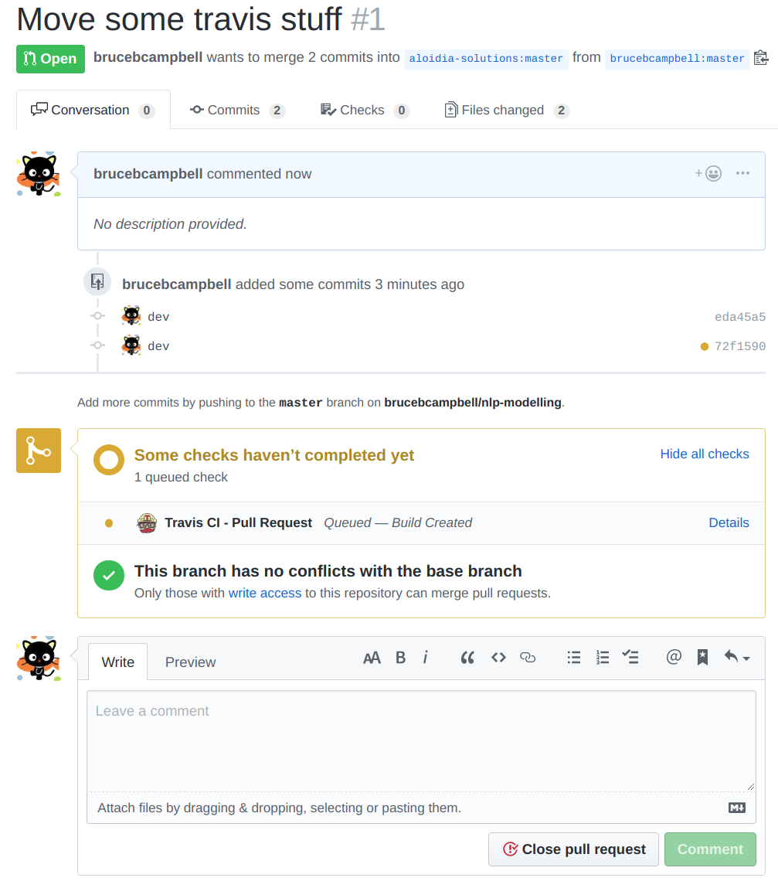

# Fork And Pull Git Workflow

Some notes on forking and pulling.

This is how we developed the nlp-modelling toolbox and will be using that repo as an example here.

The idea of a fork and pull model is that there is one maintainer of a repo and developers fork that repository, make changes, and then issue pull requests. All of this is very easy using github so we''ll just walk through that here.

## Synch with the upstream master repository
git remote add upstream https://github.com/ORIGINAL_OWNER/ORIGINAL_REPOSITORY.git
git fetch upstream
git checkout master
git merge upstream/master

```
(snowflakes) bruce@bruce-NUC8i7BEH:~/work/nlp-modelling$ git remote -v
origin	https://github.com/bruceuser_name/nlp-modelling.git (fetch)
origin	https://github.com/bruceuser_name/nlp-modelling.git (push)
(snowflakes) bruce@bruce-NUC8i7BEH:~/work/nlp-modelling$ git remote add upstream https://github.com/aloidia-solutions/nlp-modelling.git
(snowflakes) bruce@bruce-NUC8i7BEH:~/work/nlp-modelling$ git remote -v
origin	https://github.com/bruceuser_name/nlp-modelling.git (fetch)
origin	https://github.com/bruceuser_name/nlp-modelling.git (push)
upstream	https://github.com/aloidia-solutions/nlp-modelling.git (fetch)
upstream	https://github.com/aloidia-solutions/nlp-modelling.git (push)
(snowflakes) bruce@bruce-NUC8i7BEH:~/work/nlp-modelling$ git fetch upstream
remote: Enumerating objects: 16, done.
remote: Counting objects: 100% (16/16), done.
remote: Compressing objects: 100% (12/12), done.
remote: Total 15 (delta 1), reused 15 (delta 1), pack-reused 0
Unpacking objects: 100% (15/15), done.
From https://github.com/aloidia-solutions/nlp-modelling
 * [new branch]      master     -> upstream/master
(snowflakes) bruce@bruce-NUC8i7BEH:~/work/nlp-modelling$  git checkout master
Already on 'master'
Your branch is up to date with 'origin/master'.
(snowflakes) bruce@bruce-NUC8i7BEH:~/work/nlp-modelling$ git merge upstream/master
Updating 9e8ee39..49b4613
Fast-forward
 .coveragerc                                  |   7 ++
 .gitignore                                   |   6 +
 .idea/inspectionProfiles/Project_Default.xml |  14 +++
 .idea/libraries/R_User_Library.xml           |   6 +
 .idea/misc.xml                               |   7 ++
 .idea/modules.xml                            |   8 ++
 .idea/other.xml                              |   7 ++
 .idea/topic-modelling.iml                    |  16 +++
 .idea/workspace.xml                          | 215 +++++++++++++++++++++++++++++++++++
 .travis.yml                                  |  30 +++++
 10 files changed, 316 insertions(+)
 create mode 100644 .coveragerc
 create mode 100644 .gitignore
 create mode 100644 .idea/inspectionProfiles/Project_Default.xml
 create mode 100644 .idea/libraries/R_User_Library.xml
 create mode 100644 .idea/misc.xml
 create mode 100644 .idea/modules.xml
 create mode 100644 .idea/other.xml
 create mode 100644 .idea/topic-modelling.iml
 create mode 100644 .idea/workspace.xml
 create mode 100644 .travis.yml
(snowflakes) bruce@bruce-NUC8i7BEH:~/work/nlp-modelling$

```
Now that you have the changes locally go ahead and
```
git add .
git commit -m "message"
git push
```

## Issue a pull requests
After doing development on the synched fork we simple use the github web client to issue a pull request. It will happen automatically if there are no merge conflicts.


